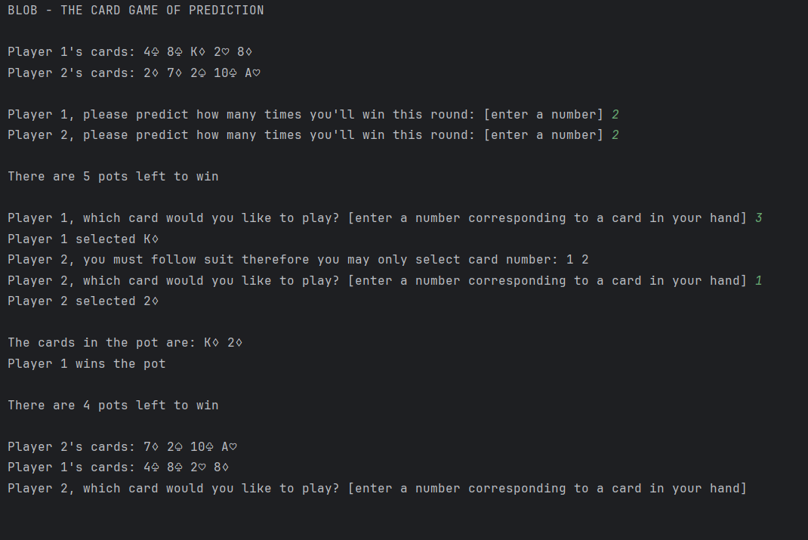

# Blob CLI App
A command line interface application of the popular card game Blob (also known as Oh Hell or Contract Whist)

# Features
- Iterative and conditional control flow statements to manage the game
- Command line interface user input to select cards from a hand
- Game logic to determine which cards are playable
- Game logic to determine the winner of the match

# Game Screenshot

